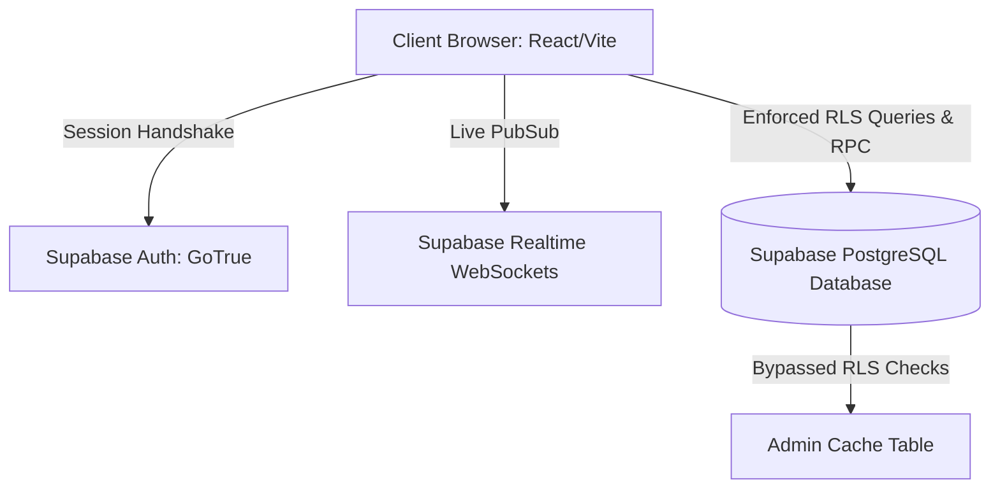
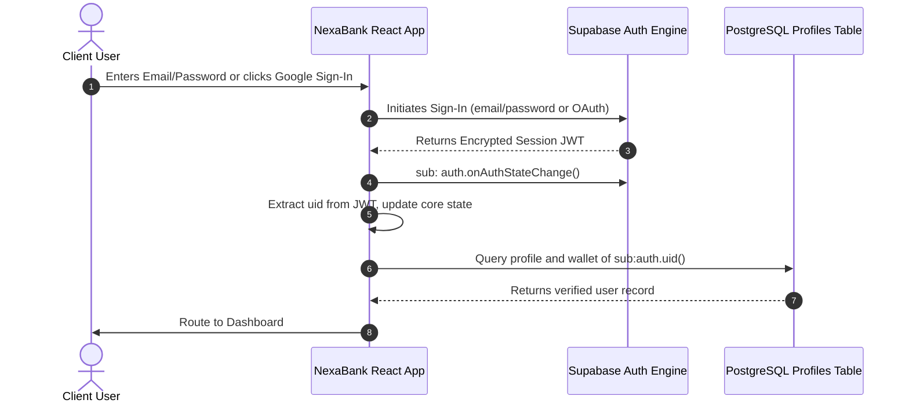
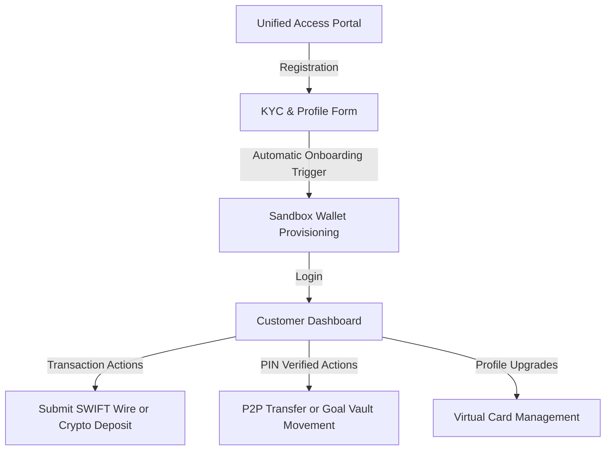
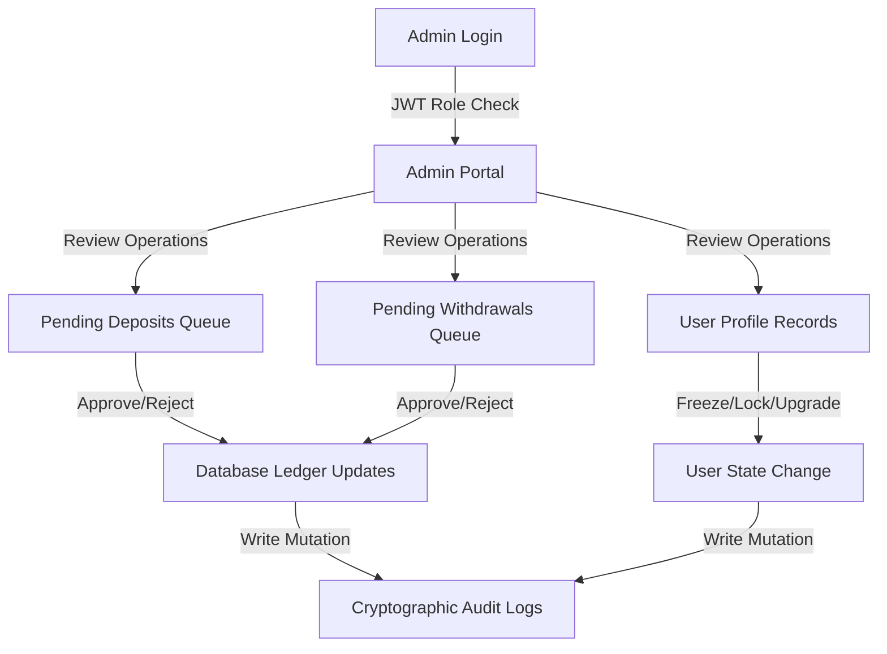

# NexaBank Architecture Specification

Welcome to the NexaBank Architecture specification. This document outlines the system architecture, authentication flows, user journeys, routing topology, and state management conventions of the NexaBank application.

---

## 🏛️ System Overview

NexaBank is built on a decoupled, secure serverless-oriented architecture. The client-side layer is powered by React, TypeScript, and Vite, while the backend database and authentication layers are handled in real-time by Supabase.



The application relies on:
1.  **Direct Database Interactivity (RLS Enforced)**: Front-end requests map directly to relational tables under strict PostgreSQL Row Level Security (RLS).
2.  **Atomic RPC Transactions**: Sensitive actions (like P2P funds transfer) are executed inside atomic transaction triggers via PostgreSQL RPC to avoid double-spend or race-condition failures.
3.  **WebSocket-Driven Sync**: Multi-client data synchronization is handled through the PostgreSQL replication stream broadcasted via Supabase Realtime Channels.

---

## 🧭 Directory & Component Hierarchy

The codebase is organized into modules based on structural domains:

```
├── src/
│   ├── main.tsx             # System bootstrapper & global stylesheets mount
│   ├── App.tsx              # Central State Controller, App Router, Ledger Sync Engine
│   ├── types.ts             # Strict System Type Contracts (Profiles, Wallets, Audit Logs)
│   ├── index.css            # Custom Tailwind CSS declarations and keyframe animations
│   ├── lib/
│   │   └── supabase.ts      # Multi-fallback, production-ready Supabase Client initializer
│   ├── components/
│   │   ├── AuthScreens.tsx  # Interactive access controls (Login, Registration, PIN verification)
│   │   └── ErrorBoundary.tsx# Defensive component for capturing visual anomalies
│   └── utils/
│       └── format.ts        # Pure visual transformers for Currency, Accounts, and Timestamps
```

---

## 🔒 Authentication Flow

Authentication follows the standard OAuth 2.0 / JWT specification using Supabase (GoTrue). When a user successfully authenticates, Supabase returns an encrypted access token containing their unique User ID (`uid`). This token is automatically set in browser storage and injected into the headers of all database queries.



---

## 🗺️ User Journeys

### 1. Standard Customer Journey
The standard customer journey focuses on secure, highly transparent banking workflows:



*   **Access Portal & KYC**: Onboarding includes a detailed 4-step onboarding questionnaire: Personal Information, Residential Address, Financial Profile, and Identity Upload.
*   **Sandbox Wallet**: Instant automated creation of Checking and Savings accounts with an account number format (`NEX-XXXXXXXXX-DEMO`).
*   **Fund Movements**: Users can request deposits (SWIFT / USDC) or create transfer actions, which trigger local state re-evaluation immediately.

### 2. System Administrator Journey
Admin portals are highly audited. Actions are locked down behind administrative roles.



*   **Portal Entrance**: Admins access a separate interface completely isolated from standard users.
*   **Ledger Updates**: Approve/Reject interfaces allow real-time manual balancing of simulated funds.
*   **Audit Trail**: Every action triggers an immutable write to `audit_logs` containing the actor's coordinates.

---

## ⚡ Routing & State Management

### Centralized Routing
Routing is managed reactively inside `src/App.tsx`. Visual modules are mounted dynamically depending on session validity, verification compliance, and RBAC flags:

```typescript
// Conceptual Routing Engine mapping to actual implementation:
if (loading) return <LoadingScreen />;
if (!session) return <AuthScreens />;
if (!isVerified) return <KYCOnboarding />;
if (profile?.role === 'admin' && activeTab === 'admin') return <AdminDashboard />;
return <CustomerDashboard />;
```

### React Hooks and WebSocket State Management
State is centralized inside the main `App` component and synchronized using standard hooks paired with Supabase's realtime publication channel:

```typescript
// Subscribing to direct database mutation feeds:
useEffect(() => {
  if (!user) return;
  const channel = supabase
    .channel('db_sync_channel')
    .on('postgres_changes', { event: '*', schema: 'public', filter: `user_id=eq.${user.id}` }, (payload) => {
      // Intelligently reload balances and notification feed
      syncActiveBalances();
    })
    .subscribe();
  return () => { supabase.removeChannel(channel); };
}, [user]);
```

For more details on specific database records and security layers, please consult:
*   [Database Specification](./DATABASE.md)
*   [Security Architecture](./SECURITY.md)
*   [Production Deployment](./DEPLOYMENT.md)

---

**Author**: Luckman World
