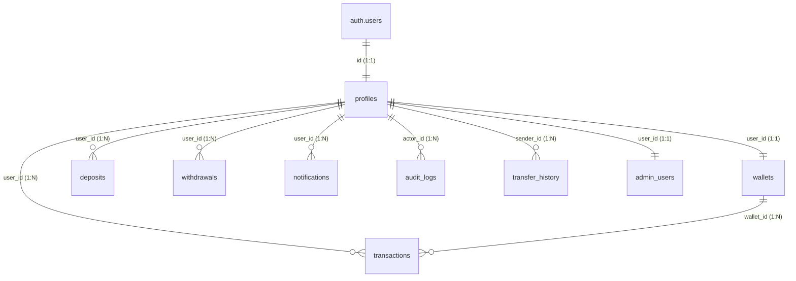

# NexaBank Database Schema Specification

This document details the complete relational database schema of NexaBank, managed inside Supabase (PostgreSQL). Every table, field, constraint, trigger, and relationship described here matches the production migration schema.

---

## 📊 Entity Relationship Diagram (ERD)

The database leverages structured normalization with strict cascading foreign key relationships linked back to Supabase's native `auth.users` entity.

---

## 🗃️ Table Catalog

### 1. `profiles`
Holds standard and extended Know Your Customer (KYC) compliance coordinates for customers and admins.
*   **Primary Reference**: `id` is a 1:1 foreign key mapping to the internal `auth.users` ledger.

| Column Name | Data Type | Constraints / Attributes | Description |
| :--- | :--- | :--- | :--- |
| `id` | `UUID` | `PRIMARY KEY`, `REFERENCES auth.users(id) ON DELETE CASCADE` | Core authentication lookup ID. |
| `name` | `TEXT` | `NOT NULL` | User's full display name. |
| `email` | `TEXT` | `NOT NULL`, `UNIQUE` | User's registered email address. |
| `role` | `TEXT` | `NOT NULL CHECK (role IN ('user', 'admin')) DEFAULT 'user'` | System permission role. |
| `status` | `TEXT` | `NOT NULL CHECK (status IN ('active', 'suspended', 'frozen', 'hold')) DEFAULT 'active'` | Operational status of the customer. |
| `withdrawal_pin_required` | `BOOLEAN` | `DEFAULT true` | If true, user must provide PIN for withdrawals/P2P. |
| `withdrawal_pin` | `TEXT` | `NULL` | Cryptographic or hashed PIN for transfer validation. |
| `is_upgraded` | `BOOLEAN` | `DEFAULT false` | Premium tier status (unlocks high virtual card benefits). |
| `phone` | `TEXT` | `NULL` | Onboarded phone number. |
| `mfa_enabled` | `BOOLEAN` | `DEFAULT false` | Flag indicating simulated MFA status. |
| `verification_status`| `TEXT` | `CHECK (verification_status IN ('verified', 'pending', 'unverified')) DEFAULT 'unverified'` | KYC state. |
| `avatar` | `TEXT` | `NULL` | URL pointing to the user's avatar image. |
| `joined_date` | `TIMESTAMPTZ`| `DEFAULT timezone('utc'::text, now())` | Onboarding timestamp. |
| `withdrawals_locked`| `BOOLEAN` | `DEFAULT false` | Flag to programmatically freeze outgoing transfers. |
| `middle_name` | `TEXT` | `NULL` | User's middle name. |
| `date_of_birth` | `DATE` | `NULL` | Date of birth. |
| `gender` | `TEXT` | `NULL` | Gender selection. |
| `country` | `TEXT` | `NULL` | Residence country code (e.g. 'US'). |
| `state_province` | `TEXT` | `NULL` | Residence state/province. |
| `city` | `TEXT` | `NULL` | Residence city. |
| `zip_postal_code` | `TEXT` | `NULL` | Zip code. |
| `residential_address`| `TEXT` | `NULL` | Full street residential address. |
| `employment_status` | `TEXT` | `NULL` | Employment state (e.g. Employed, Self-Employed). |
| `occupation` | `TEXT` | `NULL` | User's professional title. |
| `employer` | `TEXT` | `NULL` | Name of current employer. |
| `annual_income` | `NUMERIC` | `NULL` | Annual income figures. |
| `source_funds` | `TEXT` | `NULL` | Primary capital source. |
| `gov_id_type` | `TEXT` | `NULL` | Type of identity card submitted (e.g. Driver's License). |
| `gov_id_number` | `TEXT` | `NULL` | Number of submitted identity document. |
| `national_id_ssn` | `TEXT` | `NULL` | National identification number/SSN. |
| `uploaded_id_url` | `TEXT` | `NULL` | URL reference to secure digital copy of government ID. |
| `account_number` | `TEXT` | `UNIQUE` | Formatted routing-compatible account code. |
| `routing_number` | `TEXT` | `NULL` | Active routing directory code. |

---

### 2. `wallets`
Maintains checking, pending, savings balances, and virtual card allocation boundaries for a single user.

| Column Name | Data Type | Constraints / Attributes | Description |
| :--- | :--- | :--- | :--- |
| `id` | `UUID` | `PRIMARY KEY`, `DEFAULT gen_random_uuid()` | Unique wallet key identifier. |
| `user_id` | `UUID` | `UNIQUE`, `REFERENCES profiles(id) ON DELETE CASCADE` | One-to-one back-reference to user profile. |
| `main_balance` | `NUMERIC(15,2)`| `NOT NULL`, `DEFAULT 0.00` | Ledger checking balance. |
| `available_balance` | `NUMERIC(15,2)`| `NOT NULL`, `DEFAULT 0.00` | Instantly spendable funds. |
| `pending_balance` | `NUMERIC(15,2)`| `NOT NULL`, `DEFAULT 0.00` | Funds locked under compliance review. |
| `savings_balance` | `NUMERIC(15,2)`| `NOT NULL`, `DEFAULT 0.00` | High-yield savings vault division. |

---

### 3. `transactions`
The immutable ledger. Every completed peer transfer, debit purchase, administrative adjustment, or savings sweep registers a record here.

| Column Name | Data Type | Constraints / Attributes | Description |
| :--- | :--- | :--- | :--- |
| `id` | `UUID` | `PRIMARY KEY`, `DEFAULT gen_random_uuid()` | Unique transaction code. |
| `user_id` | `UUID` | `REFERENCES profiles(id) ON DELETE CASCADE` | Associated profile owner. |
| `wallet_id` | `UUID` | `REFERENCES wallets(id) ON DELETE CASCADE` | Originating checking wallet. |
| `description` | `TEXT` | `NOT NULL` | Description of statement activity (e.g. "Peer Transfer"). |
| `amount` | `NUMERIC(15,2)`| `NOT NULL` | Currency amount. |
| `date` | `TIMESTAMPTZ`| `DEFAULT timezone('utc'::text, now())` | Action execution timestamp. |
| `category` | `TEXT` | `CHECK (category IN ('deposit', 'withdrawal', 'transfer', 'bonus', 'adjustment', 'shopping', 'food', 'salary', 'utilities'))` | Category tag. |
| `type` | `TEXT` | `CHECK (type IN ('credit', 'debit'))` | Impact direction. |
| `status` | `TEXT` | `CHECK (status IN ('completed', 'pending', 'failed'))` | Settlement status. |
| `reference` | `TEXT` | `NOT NULL` | Cryptographic reference token (e.g., `NEX-TRF-XXXXX`). |

---

### 4. `deposits`
Simulated inbound funds waiting for administrative clearance.

| Column Name | Data Type | Constraints / Attributes | Description |
| :--- | :--- | :--- | :--- |
| `id` | `UUID` | `PRIMARY KEY` | Deposit session code. |
| `user_id` | `UUID` | `REFERENCES profiles(id) ON DELETE CASCADE` | Target recipient account. |
| `user_name` | `TEXT` | `NULL` | Denormalized customer name copy for speed. |
| `amount` | `NUMERIC(15,2)`| `NOT NULL` | Inbound funding sum. |
| `method` | `TEXT` | `CHECK (method IN ('bank_wire', 'crypto_usdt', 'credit_card'))` | Selected settlement portal. |
| `status` | `TEXT` | `CHECK (status IN ('pending', 'approved', 'rejected')) DEFAULT 'pending'` | Compliance status. |
| `date` | `TIMESTAMPTZ`| `DEFAULT timezone('utc'::text, now())` | Action request date. |
| `reference` | `TEXT` | `NOT NULL` | Ledger lookup reference. |

---

### 5. `withdrawals`
Requests to debit checking balances to external channels (SWIFT, Crypto USDT), subjected to compliance audits.

| Column Name | Data Type | Constraints / Attributes | Description |
| :--- | :--- | :--- | :--- |
| `id` | `UUID` | `PRIMARY KEY` | Withdrawal transaction key. |
| `user_id` | `UUID` | `REFERENCES profiles(id) ON DELETE CASCADE` | Submitting customer. |
| `user_name` | `TEXT` | `NULL` | Customer legal name cache. |
| `amount` | `NUMERIC(15,2)`| `NOT NULL` | Amount to debit. |
| `method` | `TEXT` | `CHECK (method IN ('bank_wire', 'crypto_usdt'))` | Payout destination type. |
| `status` | `TEXT` | `CHECK (status IN ('pending', 'approved', 'rejected')) DEFAULT 'pending'` | Clear status. |
| `date` | `TIMESTAMPTZ`| `DEFAULT timezone('utc'::text, now())` | Request timestamp. |
| `reference` | `TEXT` | `NOT NULL` | Audit reference token. |

---

### 6. `notifications`
Real-time messaging trays delivering ledger confirmations, card blocks, and compliance updates.

| Column Name | Data Type | Constraints / Attributes | Description |
| :--- | :--- | :--- | :--- |
| `id` | `UUID` | `PRIMARY KEY` | Notification id. |
| `user_id` | `UUID` | `REFERENCES profiles(id) ON DELETE CASCADE` | target recipient. |
| `title` | `TEXT` | `NOT NULL` | Title of notification (e.g. "Security Alert"). |
| `message` | `TEXT` | `NOT NULL` | Explicit details explaining ledger changes. |
| `read` | `BOOLEAN` | `DEFAULT false` | Read status. |
| `timestamp` | `TIMESTAMPTZ`| `DEFAULT timezone('utc'::text, now())` | Dispatch date. |

---

### 7. `audit_logs`
An immutable, append-only compliance timeline detailing system-wide modifications made by admins or triggered by security mechanisms.

| Column Name | Data Type | Constraints / Attributes | Description |
| :--- | :--- | :--- | :--- |
| `id` | `UUID` | `PRIMARY KEY` | Event code. |
| `actor_id` | `UUID` | `REFERENCES profiles(id) ON DELETE SET NULL` | Performing admin/user account. |
| `actor_name` | `TEXT` | `NULL` | Name of performer. |
| `action` | `TEXT` | `NOT NULL` | Action description (e.g., "Peer Settle", "Profile Freeze"). |
| `target_user_id` | `UUID` | `REFERENCES profiles(id) ON DELETE SET NULL` | Targeted account (if any). |
| `target_user_name`| `TEXT` | `NULL` | Target customer name cache. |
| `details` | `TEXT` | `NOT NULL` | Context detailing previous and updated states. |
| `timestamp` | `TIMESTAMPTZ`| `DEFAULT timezone('utc'::text, now())` | Action execution timestamp. |

---

### 8. `admin_users`
A cached reference table designed to bypass complex relational queries during high-frequency RLS evaluations.

| Column Name | Data Type | Constraints / Attributes | Description |
| :--- | :--- | :--- | :--- |
| `id` | `UUID` | `PRIMARY KEY` | Admin user id. |
| `user_id` | `UUID` | `UNIQUE, REFERENCES profiles(id) ON DELETE CASCADE` | Associated profile link. |
| `created_at` | `TIMESTAMPTZ`| `DEFAULT timezone('utc'::text, now())` | Elevated promotion date. |

---

### 9. `transfer_history`
Maintains persistent records of direct sender-to-receiver financial coordinates.

| Column Name | Data Type | Constraints / Attributes | Description |
| :--- | :--- | :--- | :--- |
| `id` | `UUID` | `PRIMARY KEY` | Log key. |
| `sender_id` | `UUID` | `REFERENCES profiles(id) ON DELETE CASCADE` | Source customer. |
| `receiver_id` | `UUID` | `REFERENCES profiles(id) ON DELETE CASCADE` | Destination customer. |
| `amount` | `NUMERIC(15,2)`| `NOT NULL` | Settled capital sum. |
| `timestamp` | `TIMESTAMPTZ`| `DEFAULT timezone('utc'::text, now())` | Transaction date. |
| `reference` | `TEXT` | `NOT NULL` | Lookup code. |

---

## 🎛️ Automation Triggers & Functions

### `handle_new_user()`
Triggers immediately **after** an insert on `auth.users` (GoTrue identity).
*   **Action**: Inserts a matching record into `public.profiles` containing metadata attributes, auto-generates a secure routing number and account ID, then initiates a 1:1 empty sandbox `public.wallets` ready for simulation.

### `handle_profile_role_change()`
Triggers **after** an update or insert targeting the `role` column in `public.profiles`.
*   **Action**: Syncs database privileges. If `role` is upgraded to `'admin'`, it populates `admin_users`. If demoted, it deletes from the table, updating authorization rules instantly.

For more details on security configurations and RLS architectures, see:
*   [Security Engineering Spec](./SECURITY.md)
*   [Architecture Blueprint](./ARCHITECTURE.md)

---

**Author**: Luckman World
